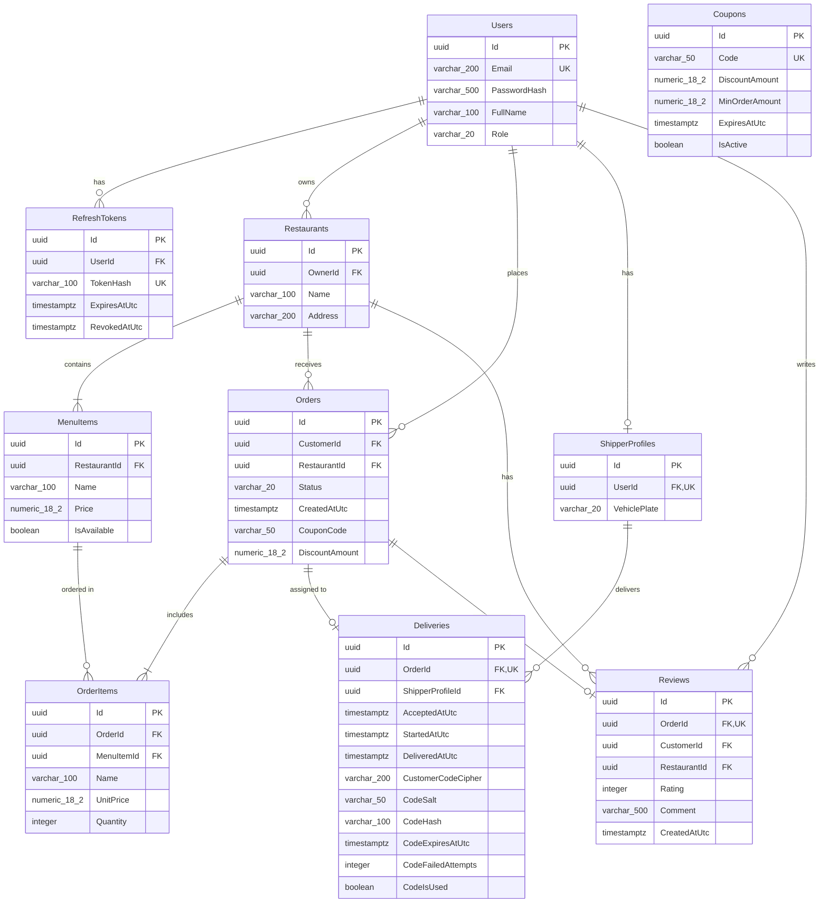

# Sơ đồ thực thể liên kết (Entity-Relationship Diagram)

Sơ đồ cơ sở dữ liệu quan hệ được sinh từ Entity Framework Core và ánh xạ vào PostgreSQL.

```mermaid
erDiagram
    Users ||--o{ RefreshTokens : "has"
    Users ||--o{ Restaurants : "owns"
    Users ||--o{ Orders : "places"
    Users ||--o| ShipperProfiles : "has"
    Users ||--o{ Reviews : "writes"

    Restaurants ||--|{ MenuItems : "contains"
    Restaurants ||--o{ Orders : "receives"
    Restaurants ||--o{ Reviews : "has"

    Orders ||--|{ OrderItems : "includes"
    Orders ||--o| Deliveries : "assigned to"
    Orders ||--o| Reviews : "reviewed by"

    MenuItems ||--o{ OrderItems : "ordered in"

    ShipperProfiles ||--o{ Deliveries : "delivers"

    Users {
        uuid Id PK
        varchar_200 Email UK
        varchar_500 PasswordHash
        varchar_100 FullName
        varchar_20 Role
    }

    RefreshTokens {
        uuid Id PK
        uuid UserId FK
        varchar_100 TokenHash UK
        timestamptz ExpiresAtUtc
        timestamptz RevokedAtUtc
    }

    Restaurants {
        uuid Id PK
        uuid OwnerId FK
        varchar_100 Name
        varchar_200 Address
    }

    MenuItems {
        uuid Id PK
        uuid RestaurantId FK
        varchar_100 Name
        numeric_18_2 Price
        boolean IsAvailable
    }

    Orders {
        uuid Id PK
        uuid CustomerId FK
        uuid RestaurantId FK
        varchar_20 Status
        timestamptz CreatedAtUtc
        varchar_50 CouponCode
        numeric_18_2 DiscountAmount
    }

    OrderItems {
        uuid Id PK
        uuid OrderId FK
        uuid MenuItemId FK
        varchar_100 Name
        numeric_18_2 UnitPrice
        integer Quantity
    }

    ShipperProfiles {
        uuid Id PK
        uuid UserId FK,UK
        varchar_20 VehiclePlate
    }

    Deliveries {
        uuid Id PK
        uuid OrderId FK,UK
        uuid ShipperProfileId FK
        timestamptz AcceptedAtUtc
        timestamptz StartedAtUtc
        timestamptz DeliveredAtUtc
        varchar_200 CustomerCodeCipher
        varchar_50 CodeSalt
        varchar_100 CodeHash
        timestamptz CodeExpiresAtUtc
        integer CodeFailedAttempts
        boolean CodeIsUsed
    }

    Reviews {
        uuid Id PK
        uuid OrderId FK,UK
        uuid CustomerId FK
        uuid RestaurantId FK
        integer Rating
        varchar_500 Comment
        timestamptz CreatedAtUtc
    }

    Coupons {
        uuid Id PK
        varchar_50 Code UK
        numeric_18_2 DiscountAmount
        numeric_18_2 MinOrderAmount
        timestamptz ExpiresAtUtc
        boolean IsActive
    }
```
